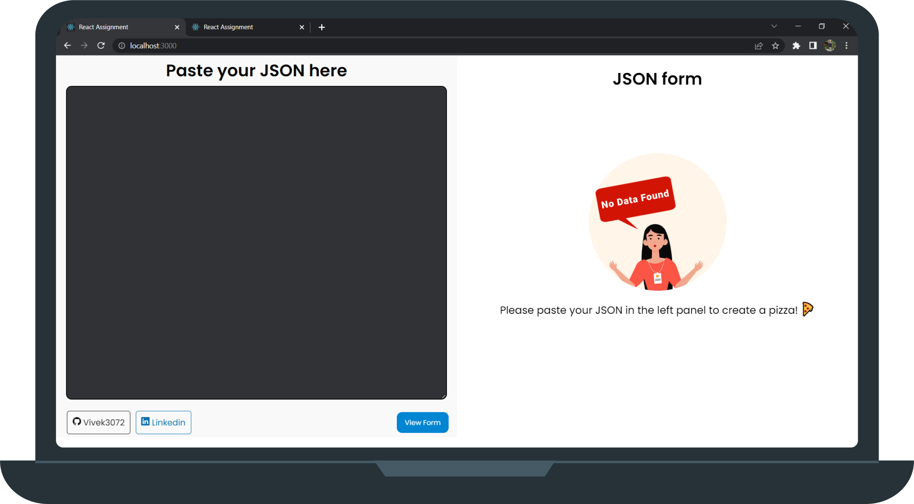

# Pizza App

 

  

 

## About the app
#### Copy the sample UI schema data from pizza.json file in the repo

This is a web app to create your pizza. Once created you can see that your pizza is ready
 
See the Live app here [https://vivek-frontend-assignment.netlify.app/](https://vivek-frontend-assignment.netlify.app/) .

 

# Getting Started with Create React App
This project was bootstrapped with [Create React App](https://github.com/facebook/create-react-app).

## Available Scripts

In the project directory, you can run:

### `npm start`

Runs the app in the development mode.\
Open [http://localhost:3000](http://localhost:3000) to view it in your browser.
